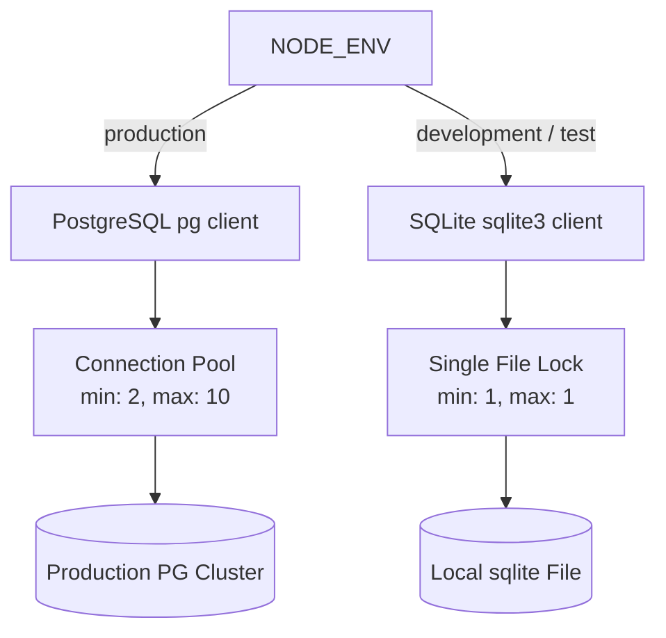

# Database Architecture & Security Guide

This document describes the architectural layout, environment-based database client switching, connection pooling, and security measures implemented in the **MilkBoy** data layer.

---

## 1. Environment Switching & Dual Client Architecture

The database system dynamically switches between a local development setup and a scalable production cluster based on the standard `NODE_ENV` configuration.

### Config Flow & Defaults
All configurations are parsed in `server/src/config/env.ts`.
* **Development**:
  * Default database client is `sqlite`.
  * Database file is stored locally at `./data/milkboy.sqlite`.
  * Connection pool size is fixed to `1` (min: 1, max: 1) to prevent database file locks (`SQLITE_BUSY`) during concurrent reads and writes.
* **Production**:
  * Automatically switches to `postgresql` when `NODE_ENV=production`.
  * Uses Knex's `pg` driver.
  * Configures connection pooling:
    * `min`: 2 active connections.
    * `max`: 10 active connections.
  * SSL security: `rejectUnauthorized: false` allows secure connections with cloud databases (like Supabase, AWS RDS, or Google Cloud SQL) without requiring manual self-signed certificates in intermediate setups.

---

## 2. Security Safeguards

### SQL Injection Protection
All database queries are structured using **Knex.js Query Builder**. Knex uses parameterized queries under the hood, binding query parameters dynamically instead of concatenating strings.
* **Bad (Vulnerable)**:
  `db.raw("SELECT * FROM users WHERE email = '" + req.body.email + "'")`
* **Good (Secure)**:
  `db('users').where('email', req.body.email).first()` (generates `SELECT * FROM users WHERE email = ?` with parameter bindings).

### Parameterized Raw Queries
Where raw SQL is necessary, variables are always bound using parameters:
`db.raw('SELECT 1 FROM roles WHERE name = ?', [roleName])`

### Least Privilege Access (Production PG)
In production environments, the database user credentials (`DB_USER`) should be restricted:
* The application user role does not require owner privileges.
* The application user should only be granted `SELECT`, `INSERT`, `UPDATE`, and `DELETE` permissions on tables.
* Data Definition Language (DDL) commands (`CREATE`, `ALTER`, `DROP`) should be reserved exclusively for migration runners executed during isolated deployments.
