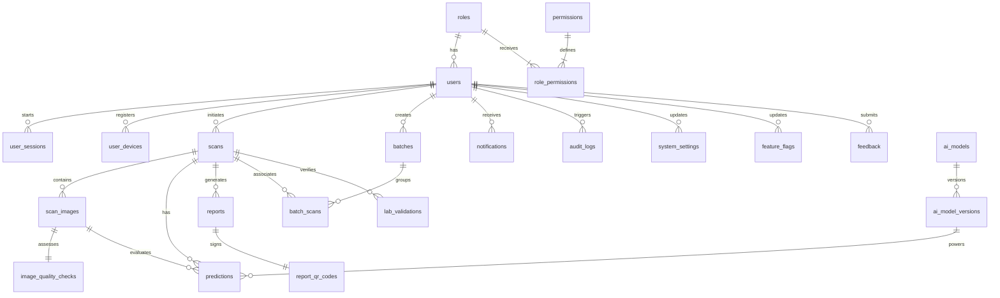

# Entity Relationship Diagram (ERD)

This document visualizes the database relationships using a Mermaid ER diagram.

---

---

## 3. Relationship Explanations

1. **RBAC Core**:
   - One `roles` record is mapped to many `users`.
   - Many-to-many junction `role_permissions` connects `roles` and `permissions`.
2. **User Identity & Operations**:
   - A user creates many `scans` (Milk Samples) and `batches`.
   - Active user sessions are tracked in `user_sessions` (1-to-many).
   - Push notification targets are stored in `user_devices` (1-to-many).
3. **Scan Execution Pipeline**:
   - A `scans` entity contains many `scan_images`.
   - Each `scan_images` entry has exactly one `image_quality_checks` report.
   - Model execution logs are recorded in `predictions`, tying `scan_images`, `scans`, and `ai_model_versions` together.
   - Scans are validated by `lab_validations` containing chemical markers logged by `Laboratory Staff` (`users` with a lab role).
4. **Grouping & Auditing**:
   - Scans can be dynamically associated with a producer's batch via the many-to-many `batch_scans` junction table.
   - Security events are logged in `audit_logs` referencing the responsible user.
