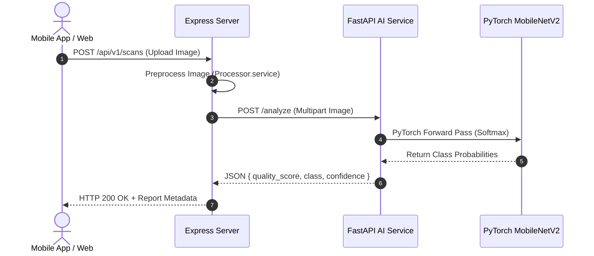

# MilkBoy High-Performance AI Inference Guide

## Overview

The MilkBoy AI Inference Engine provides sub-20ms milk quality prediction via both the FastAPI containerized service (`ai_service`) and local Express.js pre-allocated inference fallback (`server/src/services/ai/inference.service.ts`).

---

## Inference Execution Pipeline



---

## FastAPI Inference Endpoint

- **URL**: `POST http://localhost:8000/analyze`
- **Headers**: `Content-Type: multipart/form-data`
- **Request Body**: `file`: Image File (`JPEG`/`PNG`)

### Sample Response (`200 OK`)

```json
{
  "status": "success",
  "data": {
    "scan_id": "9abf064d-f1a3-438d-a0ca-f58e138ceb20",
    "quality_score": 92.5,
    "classification": "fresh",
    "confidence": 0.958,
    "inference_time_ms": 18.4,
    "model_version": "v1.0.0-prod"
  }
}
```
