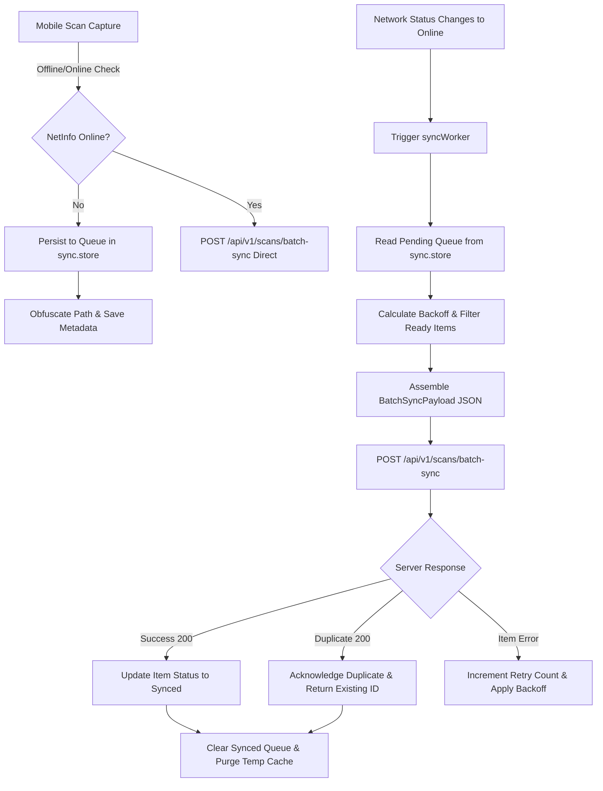

# 📶 Offline Synchronization Architecture

## Overview
MilkBoy features a resilient, Offline-First synchronization engine. When mobile network connectivity drops or becomes intermittent, the native application queues all milk quality scan captures locally in encrypted storage. Once online connectivity is restored, the `syncWorker` background engine automatically batches pending scan payloads, sends them to `POST /api/v1/scans/batch-sync`, resolves duplicate conflicts idempotently, and updates local state seamlessly.

---

## Architectural Component Flow

---

## Key Modules & Responsibilities

| Module / Component | Location | Primary Responsibility |
| :--- | :--- | :--- |
| **Network Listener** | `mobile/src/services/network.service.ts` | Real-time connection monitoring (`Wi-Fi`, `Cellular`, `Offline`) via `@react-native-community/netinfo`. |
| **Offline Queue Store** | `mobile/src/store/sync.store.ts` | Persistent state queue backed by `AsyncStorage` with path obfuscation and queue actions (`pauseSync`, `resumeSync`, `retryScan`, `cancelScan`). |
| **Background Sync Engine** | `mobile/src/services/syncWorker.ts` | Queue processor using exponential backoff + random jitter, file integrity checks, and post-sync cache purging. |
| **Batch Sync API** | `server/src/modules/scans/scans.routes.ts` | Endpoint `POST /api/v1/scans/batch-sync` supporting atomic transaction chunks, client-side idempotency keys (`clientScanId`), and partial success responses. |
| **Queue Management UI** | `mobile/src/components/OfflineSyncBanner.tsx` | Visual banner displaying online/offline status, pending item count, sync animation, and manual override controls. |

---

## Conflict Resolution & Idempotency Rules

1. **Client Scan ID (`clientScanId`)**: Every scan generated on the mobile device is assigned a unique client ID.
2. **Database Deduplication**: The `scans` database table includes an indexed `client_scan_id` column per user.
3. **Duplicate Submission Handling**: If an offline scan is re-transmitted (due to network timeout on acknowledgment), the server recognizes `client_scan_id`, returns `status: "duplicate"` along with the pre-existing `serverId` and prediction result, avoiding duplicate database records.
4. **Partial Batch Success**: If 1 out of 5 items in a batch payload fails validation, the remaining 4 items succeed and are committed to the database, while the single failed item receives `status: "failed"` with an error message for client retry.
