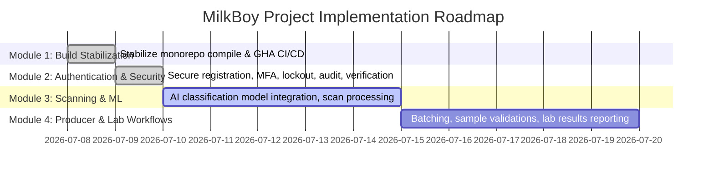

# Project Status: MilkBoy Monorepo

This document tracks the current status, modules, and completion milestones of the MilkBoy application.

---

## 📅 Roadmap Overview

---

## 🛠️ Module Status Tracker

### Module 1: Build Stabilization

- **Status**: 100% Complete ✅
- **Description**: Resolve all TypeScript compilation issues, React Native peer dependency mismatches, Metro bundler configurations, and achieve fully green CI pipelines on GitHub Actions.
- **Key Deliverable**: `BUILD_STABILIZATION_REPORT.md`

### Module 2: Authentication & Security

- **Status**: 100% Complete ✅
- **Description**: Implement production-grade auth featuring secure registration, JWT with refresh token rotation, Zod-based complex password policies, TOTP multi-factor authentication, account lockouts on brute-force attempts, full audit logging, security headers (`helmet`), and secure session management.
- **Key Deliverables**:
  - `AUTHENTICATION_REPORT.md`
  - `AUTHENTICATION_VERIFICATION_REPORT.md`
  - Complete in-memory database integration test suite (`auth.integration.test.ts`)

### Module 3: Scanning & Machine Learning

- **Status**: 0% Complete (Ready to Start) ⏳
- **Description**: Integrate CNN-based image classification models to classify milk quality in real-time, process scan uploads, perform image quality assessments (blur/lighting), generate predictions with confidence ratings, and create PDF reports containing verification QR codes.

### Module 4: Producer & Lab Workflows

- **Status**: 0% Complete ⏳
- **Description**: Core operational flows for Producers (create milk batches, group scan records) and Laboratory Staff (sample validation inputs, fat/protein/SNF parameter logging, final confirmation states).

---

## 📈 Quality Metrics

- **Total Unit/Integration Tests**: 24 tests (**100% passing**)
- **Type-Checking**: Zero errors (all workspaces)
- **ESLint**: Clean check (0 errors, 0 warnings)
- **Formatting**: 100% formatted via Prettier
- **CI Pipelines**: 100% Green on GitHub Actions (`develop` branch)
