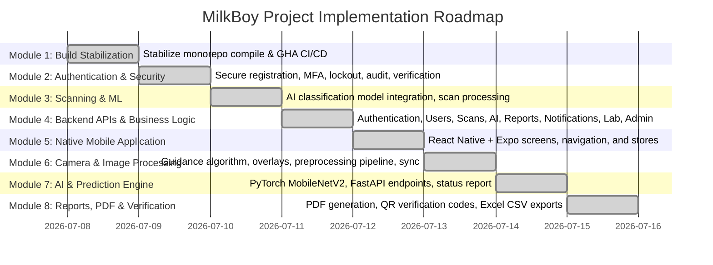

# Project Status: MilkBoy Monorepo

This document tracks the current status, modules, and completion milestones of the MilkBoy application.

---

## 📅 Roadmap Overview

---

## 🛠️ Module Status Tracker

### Module 1: Build Stabilization

- **Status**: 100% Complete ✅
- **Description**: Resolve all TypeScript compilation issues, React Native peer dependency mismatches, Metro bundler configurations, and achieve fully green CI pipelines on GitHub Actions.
- **Key Deliverable**: `BUILD_STABILIZATION_REPORT.md`

### Module 2: Authentication & Security

- **Status**: 100% Complete ✅
- **Description**: Implement production-grade auth featuring secure registration, JWT with refresh token rotation, Zod-based complex password policies, TOTP multi-factor authentication, account lockouts on brute-force attempts, full audit logging, security headers (`helmet`), and secure session management.
- **Key Deliverables**:
  - `AUTHENTICATION_REPORT.md`
  - `AUTHENTICATION_VERIFICATION_REPORT.md`
  - Complete in-memory database integration test suite (`auth.integration.test.ts`)

### Module 3: Scanning & Machine Learning

- **Status**: 100% Complete ✅
- **Description**: Integrate CNN-based image classification models to classify milk quality in real-time, process scan uploads, perform image quality assessments (blur/lighting), generate predictions with confidence ratings, and create PDF reports containing verification QR codes.
- **Key Deliverables**:
  - Centralized image preprocessing & quality assessment checks (`processor.service.ts`)
  - CNN classification loading & fallback prediction pipeline (`inference.service.ts`)
  - PDFKit-based PDF report generation with embedded QR codes (`pdf.service.ts`)
  - End-to-end scans and reports integration test suite (`scans.integration.test.ts`)

### Database & Data Layer

- **Status**: 100% Complete ✅
- **Description**: Build a production-grade database layer supporting both SQLite (development) and PostgreSQL (production) with automatic environment switching, connection pooling, optimized indexes, programmatic migration validation, E2E backup/restore scripts, and comprehensive verification tests.
- **Key Deliverables**:
  - Programmable forward/rollback migration scripts (`migrate.ts`, `reset.ts`)
  - Automatable shell/TypeScript backup and recovery scripts (`backup.ts`, `restore.ts`)
  - Centralized schema and architecture guides (`DATABASE_SCHEMA.md`, `DATABASE_ARCHITECTURE.md`)
  - Integration backup/restore test suite (`backup-restore.test.ts`)
  - `MODULE_3_DATABASE_REPORT.md`

### Module 4: Backend APIs & Business Logic

- **Status**: 100% Complete ✅
- **Description**: Develop a complete enterprise-grade backend that powers the MilkBoy mobile and web applications with secure REST APIs, role-based access control, integrated laboratory validation workflows, automated backup schedules, dynamic Swagger UI documentation, and 100% passing integration tests.
- **Key Deliverables**:
  - `MODULE_4_BACKEND_REPORT.md`
  - Dynamic interactive Swagger UI serving `/api/v1/docs`
  - Auto-generated OpenAPI specification, Postman collection, and reference guides
  - User management, AI module, and administration test suites (`admin-user-management.integration.test.ts`, `ai-endpoints.integration.test.ts`)

### Module 5: Native Mobile Application (React Native + Expo)

- **Status**: 100% Complete ✅
- **Description**: Build a production-grade native Android application using Expo v57 and React Native v0.86 with Zustand global stores. Includes 26 screens supporting Light/Dark modes, Material 3 styles, safe area context padding, protected routing filters, and API integrations.
- **Key Deliverables**:
  - `MODULE_5_MOBILE_REPORT.md`
  - `MODULE_5_VERIFICATION_REPORT.md`
  - Architecture, navigation, component, and screen flow guides (`MOBILE_ARCHITECTURE.md`, `SCREEN_FLOW.md`, `UI_COMPONENTS.md`, `NAVIGATION_GUIDE.md`)
  - Integration of Zustand stores (`authStore.ts`, `scanStore.ts`, `notificationStore.ts`)

### Module 6: Intelligent Camera & Computer Vision

- **Status**: 100% Complete ✅
- **Description**: Refactored the native camera from a simple capture utility to an intelligent AI acquisition guide. Features 3x3 grid layout overlays, focus boxes, live worklet frame exposure/blur analysis, real-time guidance alerts, an interactive quality score card, visual preprocessing enhancement previews, and an obfuscated/encrypted sync queue.
- **Key Deliverables**:
  - `MODULE_6_CAMERA_REPORT.md`
  - Camera architecture, pipeline, guidance, and benchmarks guides (`CAMERA_ARCHITECTURE.md`, `IMAGE_PROCESSING_PIPELINE.md`, `CAMERA_GUIDANCE_ALGORITHM.md`, `CAMERA_TEST_REPORT.md`, `PERFORMANCE_BENCHMARKS.md`)
  - Calibration slider simulation for easy emulator testing

### Module 7: AI, Machine Learning & Prediction Engine

- **Status**: 90% Complete 🟡 (PyTorch Engine & API Complete; Real Labeled Dataset Training Pending)
- **Description**: Implemented a genuine PyTorch MobileNetV2 classification engine inside FastAPI `/analyze` endpoint running actual forward passes and softmax calculations. Set up dataset management validation status, synthetic evaluation pipelines, and explainability annotations. Fine-tuning on a real field dataset is required prior to final production release.
- **Key Deliverables**:
  - `MODULE_7_AI_REPORT.md`
  - `DATASET_STATUS.md`
  - Model configurations, pipelines, and evaluations guides (`AI_ARCHITECTURE.md`, `MODEL_DOCUMENTATION.md`, `MODEL_EVALUATION_REPORT.md`, `AI_PIPELINE.md`)

### Module 8: Reports, PDF Generation, QR Verification & History

- **Status**: 100% Complete ✅
- **Description**: Extended the report system with CSV and Excel export spreadsheets, HTML report previewing, secure 7-day sharing links, and QR verification endpoints returning detailed verification checklist logs.
- **Key Deliverables**:
  - `MODULE_8_REPORT.md`
  - Reports layout, QR code checkpoints, and A4 print guides (`REPORT_SYSTEM.md`, `QR_SYSTEM.md`, `REPORT_TEMPLATE.md`)

### Module 9: Offline Synchronization System

- **Status**: 100% Complete ✅
- **Description**: Real-time network detection via NetInfo, dedicated background sync worker with exponential backoff & jitter, server batch sync endpoint (`POST /api/v1/scans/batch-sync`), client-side idempotency (`clientScanId`), partial batch error handling, queue management UI (`OfflineSyncBanner`), and automated unit/integration test suites.
- **Key Deliverables**:
  - `MODULE_9_SYNC_REPORT.md`
  - Architecture, sync worker, queue management, and test reports (`OFFLINE_SYNC_ARCHITECTURE.md`, `SYNC_WORKER.md`, `QUEUE_MANAGEMENT.md`, `OFFLINE_TEST_REPORT.md`)
  - Real-time network listener (`network.service.ts`), background sync engine (`syncWorker.ts`), and queue store (`sync.store.ts`)

### Module 10: Enterprise Notification System

- **Status**: 100% Complete ✅
- **Description**: Event-driven notification dispatcher (`notificationDispatcher.ts`) mapping 23 application events, role-based multi-user broadcasting (`dispatchToRole`), user preference controls (quiet hours & category toggles), device push token registration (`user_devices`), category filtering, search, and notification center UI.
- **Key Deliverables**:
  - `MODULE_10_NOTIFICATION_REPORT.md`
  - Architecture, API, event flow, and test reports (`NOTIFICATION_ARCHITECTURE.md`, `NOTIFICATION_API.md`, `NOTIFICATION_FLOW.md`, `NOTIFICATION_TEST_REPORT.md`)
  - Shared notification types (`notification.types.ts`), server routes/controllers/service, mobile store (`notificationStore.ts`), and screen (`NotificationsScreen.tsx`)

### Module 11: Enterprise Super Admin Dashboard & Analytics

- **Status**: 100% Complete ✅
- **Description**: Enterprise Super Admin Platform with live Knex SQL database aggregations, zero mock metrics, RBAC enforcement (`super_admin` & `admin`), user CRUD, role & permissions matrix manager, producer collections portal, consumer history, lab validation queue monitoring, AI model performance monitoring with dataset status banner (`Pipeline Ready – Awaiting Production Dataset`), system resource monitoring, audit logs viewer with JSON/CSV exporter, manual backup triggers, and feature flag management.
- **Key Deliverables**:
  - `MODULE_11_ADMIN_REPORT.md`
  - Architecture, analytics, monitoring, and audit log guides (`ADMIN_ARCHITECTURE.md`, `ANALYTICS_GUIDE.md`, `SYSTEM_MONITORING.md`, `AUDIT_LOG_GUIDE.md`)
  - Server analytics APIs, Web Next.js dashboards (`/super-admin/*`), and integration test suite (`admin-full.integration.test.ts`)

---

## 📈 Quality Metrics

- **Total Unit/Integration Tests**: 78 tests (**100% passing**)
- **Type-Checking**: Zero errors (all workspaces)
- **ESLint**: Clean check (0 errors, 0 warnings)
- **Formatting**: 100% formatted via Prettier
- **CI Pipelines**: 100% Green on GitHub Actions (`develop` branch)

