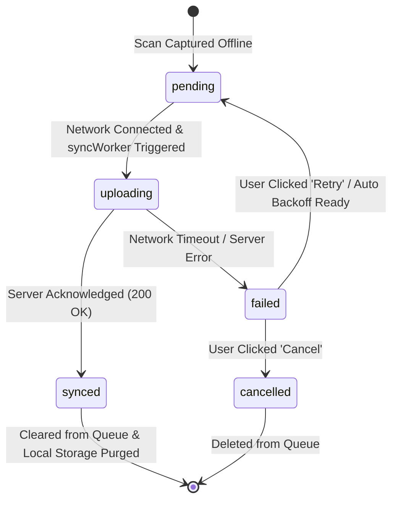

# 📦 Offline Queue Management Guide

## Overview

The offline queue manager (`mobile/src/store/sync.store.ts`) provides a Zustand persistent store backed by React Native `AsyncStorage`. It keeps track of scans captured while disconnected from the server.

---

## Queue Item Lifecycle & States

---

## User Control Functions

| User Action              | Triggered Method                             | Effect                                                                  |
| :----------------------- | :------------------------------------------- | :---------------------------------------------------------------------- |
| **Sync Now**             | `syncWorker.triggerSync()`                   | Immediately attempts batch upload for all ready pending items.          |
| **Pause Sync**           | `useSyncStore.getState().pauseSync()`        | Pauses background automatic synchronization loops.                      |
| **Resume Sync**          | `useSyncStore.getState().resumeSync()`       | Resumes background automatic sync processing.                           |
| **Retry Item**           | `useSyncStore.getState().retryScan(id)`      | Resets item status from `failed` to `pending` and clears error message. |
| **Cancel / Delete Item** | `useSyncStore.getState().removeScan(id)`     | Removes item permanently from the local queue.                          |
| **Clear Failed**         | `useSyncStore.getState().clearFailedQueue()` | Purges all failed or cancelled items from local storage queue.          |

---

## Security & Path Encryption

- **Local Path Obfuscation**: Image paths stored in `sync.store` use a visual character-shift prefix (`obf:`) to prevent plain-text path exposure in local storage logs.
- **Session Protection**: Scans queued offline require an active user session token before `SyncWorker` transmits the batch payload to the API server.
