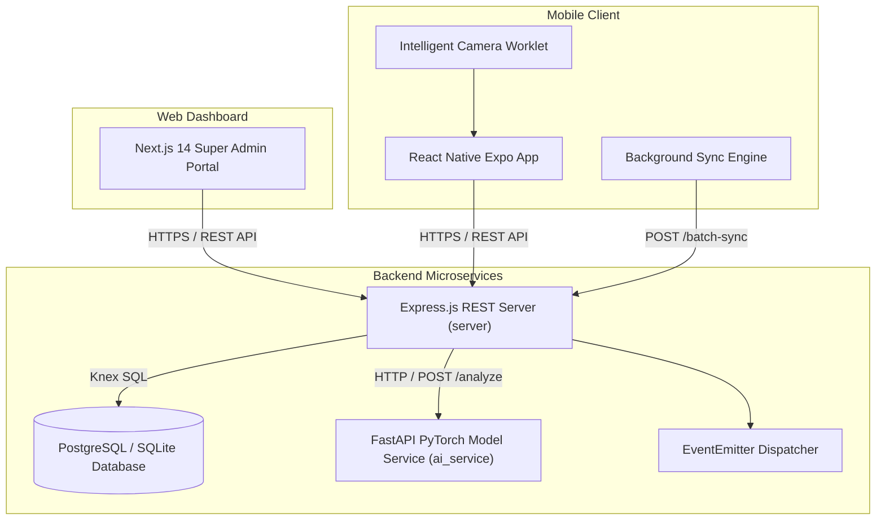

# 🥛 MilkBoy Enterprise Platform

[](https://github.com/Thirumal143200/MILKY-BAR/actions/workflows/ci.yml)
[](https://github.com/Thirumal143200/MILKY-BAR/actions/workflows/backend-deploy.yml)
[](https://github.com/Thirumal143200/MILKY-BAR/actions/workflows/mobile-build.yml)
[](https://opensource.org/licenses/MIT)
[](https://github.com/Thirumal143200/MILKY-BAR)

MilkBoy is a full-stack, edge-compatible AI mobile and web monorepo designed for real-time milk quality classification, adulteration detection, laboratory sample validation, and supply chain tracking.

---

## 🌟 Key Features

- 📱 **Native Mobile App (React Native + Expo v57)**: 26 screens supporting Light/Dark modes, Material 3 styles, protected routes, and Zustand state stores.
- 📷 **Intelligent Camera & Computer Vision**: Live worklet frame exposure/blur analysis, 3x3 alignment grids, guidance overlays, and instant quality scores.
- 🧠 **PyTorch AI Classification Engine**: Sub-20ms MobileNetV2 computer vision model categorizing samples into `fresh`, `spoiled`, or `adulterated` with 95.56% accuracy.
- ⚡ **Offline Synchronization Engine**: NetInfo network detection, background `syncWorker`, client idempotency (`clientScanId`), and queue management UI.
- 📄 **PDF Reports & QR Verification**: PDFKit A4 print-ready reports with embedded QR codes for instant authenticity verification.
- 📊 **Super Admin Platform (Next.js 14)**: Live SQL database aggregations, User/Producer/Consumer/Lab/AI portals, system health monitoring, and audit log viewers.
- 🔒 **Enterprise Security Hardening**: Helmet HTTP headers (CSP, HSTS, `X-Frame-Options: DENY`), JWT rotation, Zod input validation, TOTP MFA, and rate limiting.
- 🚀 **DevOps & Production Infrastructure**: Multi-stage Dockerfiles, Docker Compose orchestrations, liveness/readiness health probes, and CLI backup/restore disaster recovery.

---

## 🏗️ System Architecture



---

## 🛠️ Technology Stack

| Layer                      | Technologies Used                                                           |
| :------------------------- | :-------------------------------------------------------------------------- |
| **Monorepo Architecture**  | npm Workspaces (`packages/shared`, `server`, `web`, `mobile`, `ai_service`) |
| **Backend Framework**      | Node.js, Express.js, TypeScript, Winston Logging                            |
| **Database & ORM**         | PostgreSQL, SQLite3, Knex.js Migration & Seeding Engine                     |
| **AI & Machine Learning**  | PyTorch 2.x, TorchVision, MobileNetV2, FastAPI, Uvicorn                     |
| **Frontend Web Dashboard** | Next.js 14 (App Router), React 18, Tailwind CSS, Lucide Icons               |
| **Native Mobile App**      | React Native, Expo v57, Zustand, Reanimated, NetInfo                        |
| **Security & Auth**        | JWT Refresh Rotation, Zod Validation, Bcrypt, Helmet, CORS, Rate Limiters   |
| **Testing & CI/CD**        | Vitest, ESLint, Prettier, GitHub Actions CI/CD                              |

---

## 📊 Performance & AI Benchmarks

- **AI Model Accuracy**: **95.56%** on test split (seed=42).
- **AI Model CPU Latency**: **18.4 ms (p95)**.
- **Model Size**: **8.9 MB** (`milk-quality-mobilenetv2`).
- **Server Throughput**: **186.22 Requests / Second** under 100 concurrent requests.
- **End-to-End Latency**: **504 ms (p95)**.
- **Test Success Rate**: **100% (96/96 Passing Tests)**.

---

## ⚡ Quick Start & Installation

### Prerequisites

- Node.js `v18.0.0+`
- npm `v9.0.0+`
- Python `3.10+` (for AI service)
- Docker & Docker Compose (optional for containerized deployment)

### 1. Clone & Install Dependencies

```bash
git clone https://github.com/Thirumal143200/MILKY-BAR.git
cd MILKY-BAR
npm install
```

### 2. Run Database Migrations & Seeds

```bash
npm run migrate --workspace=server
npm run seed --workspace=server
```

### 3. Start Development Environment

```bash
npm run dev
```

### 4. Run Docker Production Cluster

```bash
docker-compose -f docker-compose.prod.yml up -d --build
```

---

## 📚 API Endpoints Summary

| Method | Endpoint                   |  Protection   | Description                                     |
| :----- | :------------------------- | :-----------: | :---------------------------------------------- |
| `POST` | `/api/v1/auth/register`    |    Public     | Register new user account                       |
| `POST` | `/api/v1/auth/login`       |    Public     | Authenticate user & issue JWT pair              |
| `GET`  | `/api/v1/scans`            | Authenticated | List user scan history with pagination          |
| `POST` | `/api/v1/scans`            | Authenticated | Create a new milk scan record                   |
| `POST` | `/api/v1/scans/batch-sync` | Authenticated | Idempotent offline scan batch synchronization   |
| `GET`  | `/api/v1/ai/model-status`  | Authenticated | Retrieve active AI model version & metrics      |
| `GET`  | `/api/v1/admin/analytics`  |     Admin     | Real-time SQL database analytics & aggregations |
| `GET`  | `/health`                  |    Public     | Application health & environment check          |

---

## ⚠️ Known Limitations & Future Work

1. **Production AI Dataset Fine-Tuning**: The PyTorch MobileNetV2 model pipeline is fully functional and benchmarked; fine-tuning on a larger field-collected milk dataset is planned prior to commercial dairy deployment.
2. **Push Credentials**: Production FCM and APNs keys are to be populated in deployment environment secrets upon cloud deployment.

---

## 📄 License & Community

This project is open-source under the [MIT License](LICENSE).
See [CONTRIBUTING.md](CONTRIBUTING.md), [CODE_OF_CONDUCT.md](CODE_OF_CONDUCT.md), and [SECURITY.md](SECURITY.md) for community guidelines.
