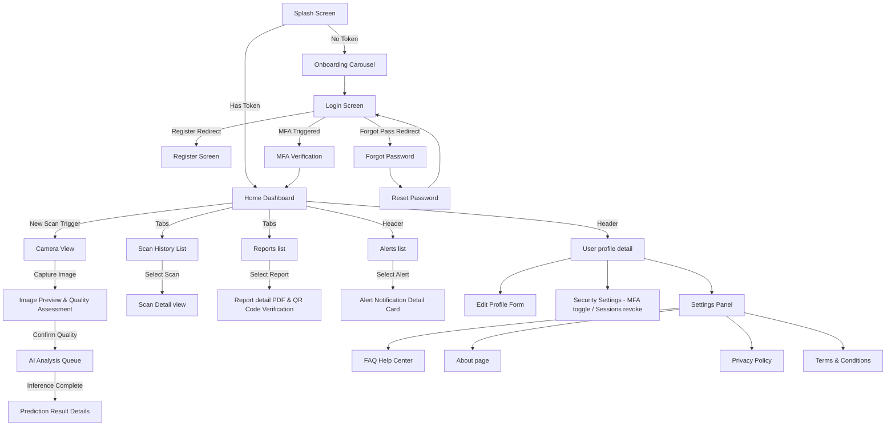

# Screen Flow & State Transitions

This document details the navigation flows, state transitions, and user journeys inside the MilkBoy native application.

---

## 1. User Journeys Diagram

```mermaid
graph TD
    Splash[Splash Screen] -->|No Token| Onboarding[Onboarding Carousel]
    Splash -->|Has Token| Home[Home Dashboard]
    Onboarding --> Login[Login Screen]
    Login -->|Register Redirect| Register[Register Screen]
    Login -->|Forgot Pass Redirect| ForgotPass[Forgot Password]
    ForgotPass --> ResetPass[Reset Password]
    ResetPass --> Login
    Login -->|MFA Triggered| MFA[MFA Verification]
    MFA --> Home

    Home -->|New Scan Trigger| Camera[Camera View]
    Camera -->|Capture Image| Preview[Image Preview & Quality Assessment]
    Preview -->|Confirm Quality| Processing[AI Analysis Queue]
    Processing -->|Inference Complete| Result[Prediction Result Details]

    Home -->|Tabs| History[Scan History List]
    History -->|Select Scan| ScanDetails[Scan Detail view]

    Home -->|Tabs| Reports[Reports list]
    Reports -->|Select Report| ReportDetails[Report detail PDF & QR Code Verification]

    Home -->|Header| Notifications[Alerts list]
    Notifications -->|Select Alert| AlertDetails[Alert Notification Detail Card]

    Home -->|Header| Profile[User profile detail]
    Profile --> EditProfile[Edit Profile Form]
    Profile --> Security[Security Settings - MFA toggle / Sessions revoke]
    Profile --> Settings[Settings Panel]

    Settings --> Help[FAQ Help Center]
    Settings --> About[About page]
    Settings --> Privacy[Privacy Policy]
    Settings --> Terms[Terms & Conditions]
```
