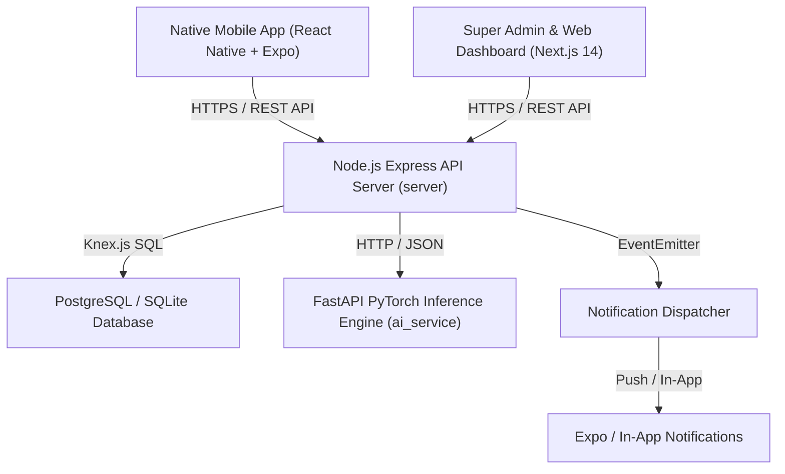

# System Architecture Blueprint — MilkBoy Enterprise Platform

## Overall Monorepo Topology

---

## Workspace Directory Organization

- `packages/shared` — Centralized TypeScript interfaces, Zod validation schemas, error codes, and configuration constants.
- `server` — Express.js REST backend, Knex migrations, seeders, services, controllers, rate limiters, audit loggers, and test suites.
- `web` — Next.js 14 App Router Super Admin platform, analytics dashboards, lab queue managers, and producer portals.
- `mobile` — React Native Expo native Android application with 26 screens, Zustand global state, intelligent camera guidance, and offline sync worker.
- `ai_service` — PyTorch MobileNetV2 FastAPI microservice providing milk quality classification and fallback heuristics.
