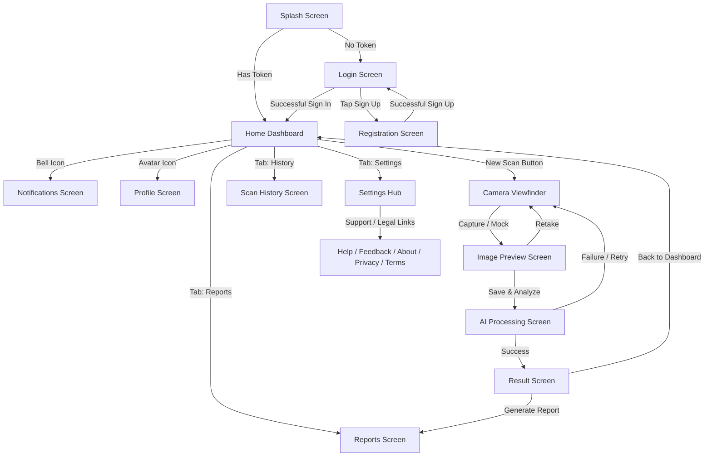
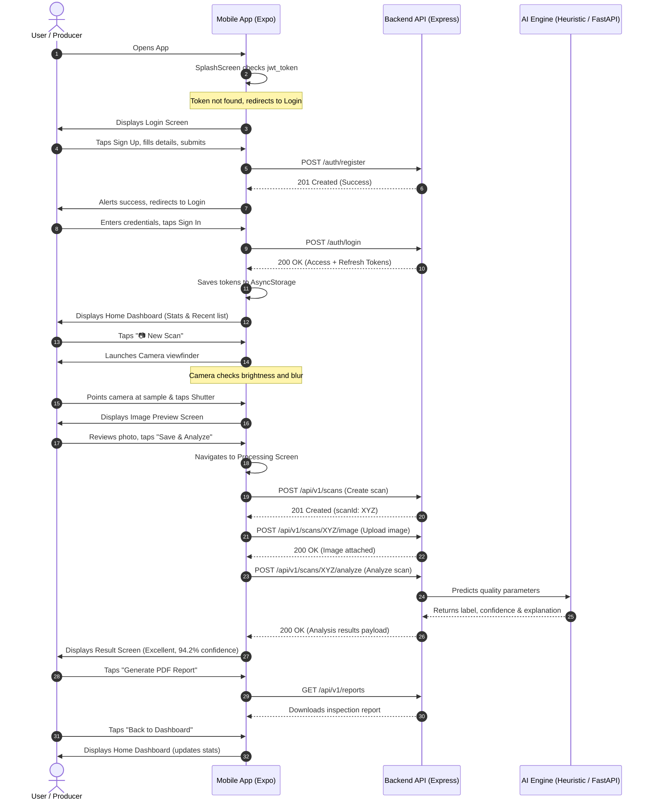

# MilkBoy Mobile Application Walkthrough & User Journey

This walkthrough provides a comprehensive guide to every screen in the **MilkBoy** React Native (Expo) mobile application, detailing their functions, routing flow, API endpoints, and backend connections.

---

## High-Fidelity UI Preview

Below is a preview of the premium dark-themed dashboard design implemented for the MilkBoy mobile experience:

---

## Screen Flow and Navigation Architecture

---

## Mobile Screen Directory & Specifications

### 1. Splash Screen (`SplashScreen.tsx`)

- **Purpose**: The application loading screen that checks session state.
- **Aesthetics**: Sleek dark layout with a pulsating logo.
- **User Route**: Opens automatically upon launching the app.
- **APIs Called**: None (reads locally).
- **Backend Connection**: Accesses `AsyncStorage` to check for `jwt_token`. If present, it routes to **Home**; otherwise, it redirects to **Login**.

### 2. Login Screen (`LoginScreen.tsx`)

- **Purpose**: Authenticates registered users.
- **Aesthetics**: Glassmorphism cards, bold typography, and input highlights.
- **User Route**: Reached from **Splash Screen** (if unauthenticated) or **Registration**.
- **APIs Called**: `POST /api/v1/auth/login`
- **Backend Connection**: Submits email and password, receives JWT and refresh tokens. Saves tokens and user role to `AsyncStorage`, then navigates to **Home**. Includes a bottom shortcut to the **Registration Screen**.

### 3. Registration Screen (`RegisterScreen.tsx`)

- **Purpose**: Creates new accounts for consumers, producers, or lab staff.
- **Aesthetics**: Structured multi-input fields, role selectors, and password complexity guidance text.
- **User Route**: Reached from the "Don't have an account? Sign Up" link on the **Login Screen**.
- **APIs Called**: `POST /api/v1/auth/register`
- **Backend Connection**: Validates form inputs (first name, last name, email, password strength, phone, role) and creates a new database user record. On success, prompts user and returns to **Login**.

### 4. Home Dashboard (`HomeScreen.tsx`)

- **Purpose**: The central user panel showing scan stats and recent scans.
- **Aesthetics**: Premium widgets with glowing indicator numbers, pull-to-refresh container, and badge listings.
- **User Route**: Reached upon successful login or token validation.
- **APIs Called**: `GET /api/v1/scans` (lists user scans).
- **Backend Connection**: Syncs local database logs, pulls online history, and calculates quick stats (total scans, fresh milk count, spoiled alerts). Provides quick navigation headers to **Profile** and **Notifications**, a floating **New Scan** trigger, and a bottom tab navigation hub.

### 5. Camera Screen (`CameraScreen.tsx`)

- **Purpose**: Captures photos of milk samples using the device camera.
- **Aesthetics**: Full-screen dark viewfinder with real-time HUD overlays.
- **User Route**: Reached by tapping the **New Scan** button on **Home**.
- **APIs Called**: None (local hardware interaction).
- **Backend Connection**: Utilizes a real-time `useFrameProcessor` to calculate brightness and blur. It alerts users if it's too dark, too bright, or blurry, and disables the shutter until criteria are met.
- **Simulator Fallback**: If no camera device is found, it renders a simulated interface allowing the developer to capture a high-quality mock sample image for complete walkthrough validation.

### 6. Image Preview Screen (`PreviewScreen.tsx`)

- **Purpose**: Allows users to review the photo before sending it to the AI engine.
- **Aesthetics**: High contrast image review screen with quick action buttons.
- **User Route**: Reached immediately after capturing a photo.
- **APIs Called**: None.
- **Backend Connection**: Reads the image file location. Offers a "Retake" option to go back, or "Save & Analyze" which appends the scan locally and redirects to the **AI Processing Screen**.

### 7. AI Processing Screen (`ProcessingScreen.tsx`)

- **Purpose**: Foreground pipeline runner displaying processing stages.
- **Aesthetics**: Deep dark gradient background with a glowing ring scanner progress indicator.
- **User Route**: Reached from the **Preview Screen** after selecting "Save & Analyze".
- **APIs Called**:
  1. `POST /api/v1/scans` (creates scan record).
  2. `POST /api/v1/scans/:id/image` (uploads binary image).
  3. `POST /api/v1/scans/:id/analyze` (triggers AI heuristic prediction).
- **Backend Connection**: Sequentially creates, uploads, and analyzes the sample. Shows progress text stages (e.g., "Uploading sample...", "Running AI classification...") and navigates directly to the **Result Screen** upon success.

### 8. Result Screen (`ResultScreen.tsx`)

- **Purpose**: Displays the final AI classification and milk parameters.
- **Aesthetics**: Large color-coded assessment cards (Green for Excellent/Good, Orange for acceptable, Red for Spoiled/Adulterated) with large circular confidence scores.
- **User Route**: Reached automatically from **AI Processing Screen** on success.
- **APIs Called**: None (receives state payload).
- **Backend Connection**: Displays predictions (`qualityLabel`, `confidence`, `explanation`) and details. Includes sharing shortcuts, a "Generate PDF Report" button (navigates to **Reports**), and a "Back to Dashboard" button.

### 9. Reports Screen (`ReportsScreen.tsx`)

- **Purpose**: Lists generated PDF inspection documents.
- **Aesthetics**: Dark cards detailing date, title, and PDF generation status.
- **User Route**: Reached from the bottom navigation bar or from the **Result Screen**.
- **APIs Called**: `GET /api/v1/reports`
- **Backend Connection**: Lists available reports. Tapping a report downloads or views the compiled PDF.

### 10. Scan History Screen (`ScanHistoryScreen.tsx`)

- **Purpose**: Searchable, historical log of all scans.
- **Aesthetics**: Filtering tabs, search bar, and badge listings.
- **User Route**: Reached from the bottom navigation bar or Settings.
- **APIs Called**: `GET /api/v1/scans` (filtered by search query).
- **Backend Connection**: Lets users search historical records by date, label, or notes, with interactive detail navigation.

### 11. Notifications Screen (`NotificationsScreen.tsx`)

- **Purpose**: Lists user alerts and system messages.
- **Aesthetics**: Status indicators, unread indicators, and a quick "Read All" shortcut.
- **User Route**: Reached from the header bell icon on **Home**.
- **APIs Called**:
  - `GET /api/v1/notifications` (lists alerts)
  - `PATCH /api/v1/notifications/:id/read` (marks single read)
  - `POST /api/v1/notifications/read-all` (marks all read)
- **Backend Connection**: Feeds real-time system alerts (e.g., completed batch reports, lab validation updates) to the user.

### 12. Profile Screen (`ProfileScreen.tsx`)

- **Purpose**: Displays account details, edits credentials, and monitors active devices.
- **Aesthetics**: Curved panels, bold uppercase labels, initials avatar, and session listings.
- **User Route**: Reached from the header profile icon on **Home** or via Settings.
- **APIs Called**:
  - `GET /api/v1/users/me` (loads profile)
  - `PATCH /api/v1/users/me` (saves changes)
  - `GET /api/v1/users/me/sessions` (lists active devices)
- **Backend Connection**: Displays account details and login history, with interactive fields to update personal details.

### 13. Settings Screen (`SettingsScreen.tsx`)

- **Purpose**: The support and legal navigation hub.
- **Aesthetics**: Grouped iOS-style items with chevron pointers and a red logout button.
- **User Route**: Reached from the bottom navigation bar.
- **APIs Called**: None.
- **Backend Connection**: Navigates to sub-screens (Help, Feedback, About, Privacy, Terms). Pressing "Log Out" clears stored JWT tokens and navigates back to **Login**.

### 14. Help Center Screen (`HelpScreen.tsx`)

- **Purpose**: Guidance and FAQ center.
- **Aesthetics**: Collapsible item cards and list bullet panels.
- **User Route**: Reached by tapping "Help Center" under Settings.
- **APIs Called**: None.
- **Backend Connection**: Guides users on proper lighting parameters, cleanliness, and device parallel depth for the scanner.

### 15. Feedback Screen (`FeedbackScreen.tsx`)

- **Purpose**: Submits bugs and recommendations.
- **Aesthetics**: Switch labels, dark text fields, and priority selectors.
- **User Route**: Reached by tapping "Feedback" under Settings.
- **APIs Called**: `POST /api/v1/feedback`
- **Backend Connection**: Form collects category type (Feedback, Bug Report, Feature Request), Priority level, Subject line, and detailed description. Validates fields and uploads directly to the database.

### 16. About Screen (`AboutScreen.tsx`)

- **Purpose**: App versions, credentials, and technical data.
- **Aesthetics**: Minimalistic card centered around version numbers and copyrights.
- **User Route**: Reached by tapping "About" under Settings.
- **APIs Called**: None.
- **Backend Connection**: Displays static license terms, software details, and credits.

### 17. Privacy Policy (`PrivacyScreen.tsx`)

- **Purpose**: Legally required data protection details.
- **Aesthetics**: Rounded scrolling legal containers.
- **User Route**: Reached by tapping "Privacy Policy" under Settings.
- **APIs Called**: None.
- **Backend Connection**: Informs user of image transmission, local caching safety, and data rights.

### 18. Terms of Service (`TermsScreen.tsx`)

- **Purpose**: Application guidelines and advisory usage terms.
- **Aesthetics**: Rounded scrolling legal containers.
- **User Route**: Reached by tapping "Terms of Service" under Settings.
- **APIs Called**: None.
- **Backend Connection**: Highlights accountability boundaries and the advisory status of the AI prediction metrics.

---

## Complete User Journey: Milk Quality Scan

The typical end-to-end user journey for a dairy producer or consumer consists of the following steps:

